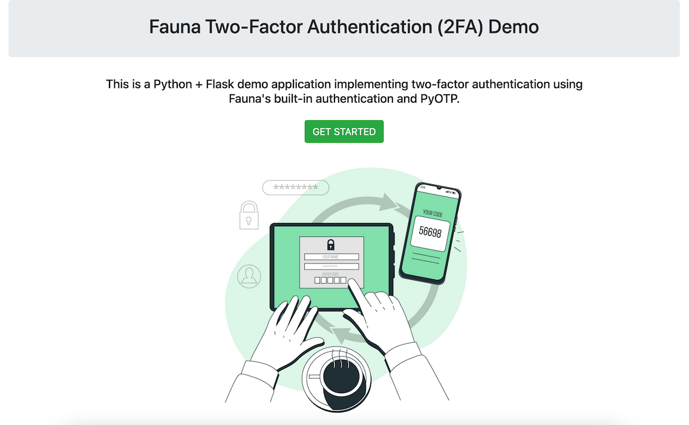

# Fauna Two-Factor Authentication (2FA) Demo

This is a Python + Flask demo application implementing two-factor authentication using Fauna's built-in authentication and PyOTP.

You can also check [this gist](https://gist.github.com/LordGhostX/9d70357f9803904506939ab6f4bb3a9a) that implements Fauna's user authentication in Python.

The tutorial for this repository exists on [LordGhostX's blog](https://dev.to/LordGhostX).

